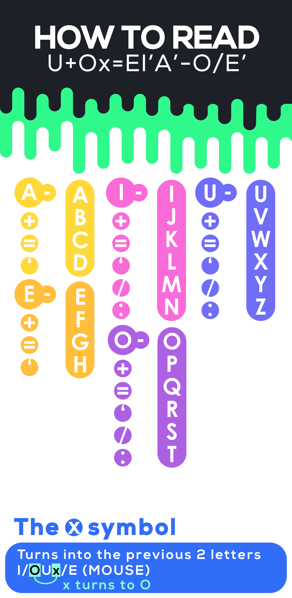

# VowelDash

## What is VowelDash?
VowelDash is a text encryption that I made for both testing and learning purposes

## How does it work?
Good question.

Simply put a \<Vowel\> as the head and \<Symbols\> on the back 
<br>
The symbols (in order) are **-+='/:** (but for letters "A" and "E", they only have "-+='")
<br>
Vowel + Symbol ends >> Letter
<br>
The symbol ends "shift" the letters accordingly. A+ would be A + 1 = B, A= would be A + 2 = C
<br>
There is also the **x** symbol which is very complicated. It takes the previous 2 letters (including other x's) and kinda convert into that letter. so A:Ix' is BID (the x turned into A, A' is D)
<br>
(For the dashes "-", they're a little bit confusing..)

## Examples plez
```
VowelDash >> Readable text

A >> A (obviously)
A+ >> B
A+-' >> BAD
A- >> [Imperfect] (When you just want 'A', but it doesn't have any other symbols beside it, don't type the "-")
A-- >> AA (Don't get confused! The number of symbols are going to be the number of letters, so 2 dashes mean 2 letter "A"s)
A/ >> [Incorrect]
**If you want to type "E" or "F", instead type:**
E >> E
E+ >> F
This is because vowel A is not allowed to surpass vowel E
E'-I''O >> HELLO
I-:O:Ex'xx/:I-:E= >> INTERESTING

ok, you understand? no? good
(btw, backslashes also work so something like I\'/ >> I'M)
```
(Also special thanks to [Charon77](https://github.com/Charon77) for helping me make the decoder)


